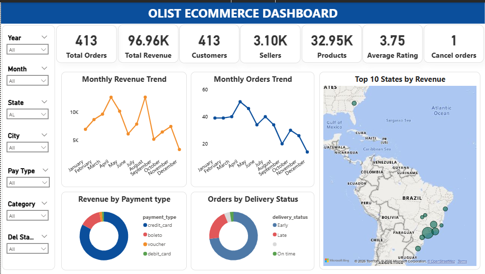
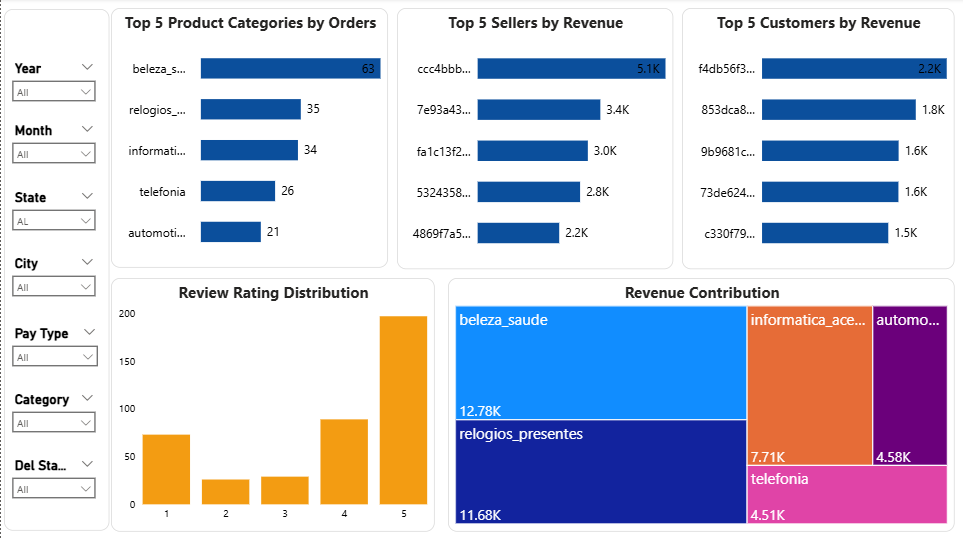

# 🛒 End-to-End E-commerce Sales Analytics using Olist Dataset

## 📌 Project Overview

This project presents an end-to-end analysis of the **Olist Brazilian E-commerce Public Dataset**. The objective is to transform raw transactional data into meaningful business insights that can support data-driven decision-making.

The project covers the complete analytics workflow, including data understanding, cleaning, exploratory data analysis (EDA), SQL analysis, and interactive dashboard development in Power BI.

---

# 🎯 Business Objective

The goal of this project is to help an e-commerce company answer important business questions such as:

- Which product categories generate the highest revenue?
- How are sales changing over time?
- Which states contribute the most revenue?
- Which payment methods are most preferred by customers?
- How does delivery performance affect customer satisfaction?
- Which products receive the best customer ratings?

The insights obtained can help improve sales, customer experience, and operational efficiency.

---

# 📂 Dataset

**Dataset Name:** Olist Brazilian E-commerce Public Dataset

🔗 **Dataset Link:**  
https://www.kaggle.com/datasets/olistbr/brazilian-ecommerce


The dataset contains over **100,000 orders** distributed across multiple relational tables.

---

# 🛠️ Tools & Technologies

- Python (Pandas, NumPy, Matplotlib)
- MySQL
- Power BI
- Microsoft Excel
- Git & GitHub

---

# 📊 Project Workflow

```
Raw Dataset
      ↓
Data Understanding
      ↓
Data Cleaning
      ↓
Exploratory Data Analysis
      ↓
SQL Business Analysis
      ↓
Power BI Dashboard
      ↓
Business Insights
```

---

# 🧹 Data Cleaning

The following data quality checks were performed:

- Checked data types
- Handled missing values
- Removed duplicate records
- Validated primary keys
- Checked referential integrity
- Verified date consistency
- Created derived columns for analysis

---

# 🔍 Exploratory Data Analysis (EDA)

Performed analysis on:

- Sales Trends
- Revenue Distribution
- Product Categories
- Customer Behavior
- Payment Methods
- Review Ratings
- Delivery Performance
- State-wise Sales

---

# 📈 SQL Analysis

Business questions answered using SQL include:

- Monthly Revenue Trend
- Top Product Categories by Revenue
- Top States by Revenue
- Most Preferred Payment Methods
- Average Review Ratings
- Revenue by Payment Type
- Delivery Performance Analysis
- Customer Purchase Analysis

---

# 📊 Power BI Dashboard

The interactive dashboard includes:

## Executive KPIs

- Total Revenue
- Total Orders
- Total Customers
- Average Order Value

## Sales Analysis

- Monthly Revenue Trend
- Revenue by Product Category
- Revenue by State

## Customer Analysis

- Customer Distribution
- Customer Reviews
- Customer Purchase Behavior

## Logistics Analysis

- Delivery Performance
- Shipping Analysis
- Order Status Distribution

---

# 💡 Key Insights

- Identified the highest revenue-generating product categories.
- Analyzed monthly sales trends and seasonal patterns.
- Compared customer payment preferences.
- Evaluated delivery performance across orders.
- Identified top-performing states based on revenue.
- Analyzed customer review ratings and purchasing behavior.

---

# 📷 Dashboard Preview

## Dashboard1



## Dashboard2



---

# 📁 Project Structure

```
📦 Ecommerce-Data-Analytics
│
├── data
│   ├── raw
│   └── cleaned
│
├── notebooks
│   └── olist_cleaning.ipynb
│
├── sql
│   └── EDA.sql
│
├── powerbi
│   └── dashboard.pbix
│
├── images
│   ├── image1.png
│   └── image2.png
│
└── README.md
```

---

# 📬 Connect With Me

**Sai Meghana Guduru**

**LinkedIn:**  
https://www.linkedin.com/in/guduru-sai-meghana-77252732a
